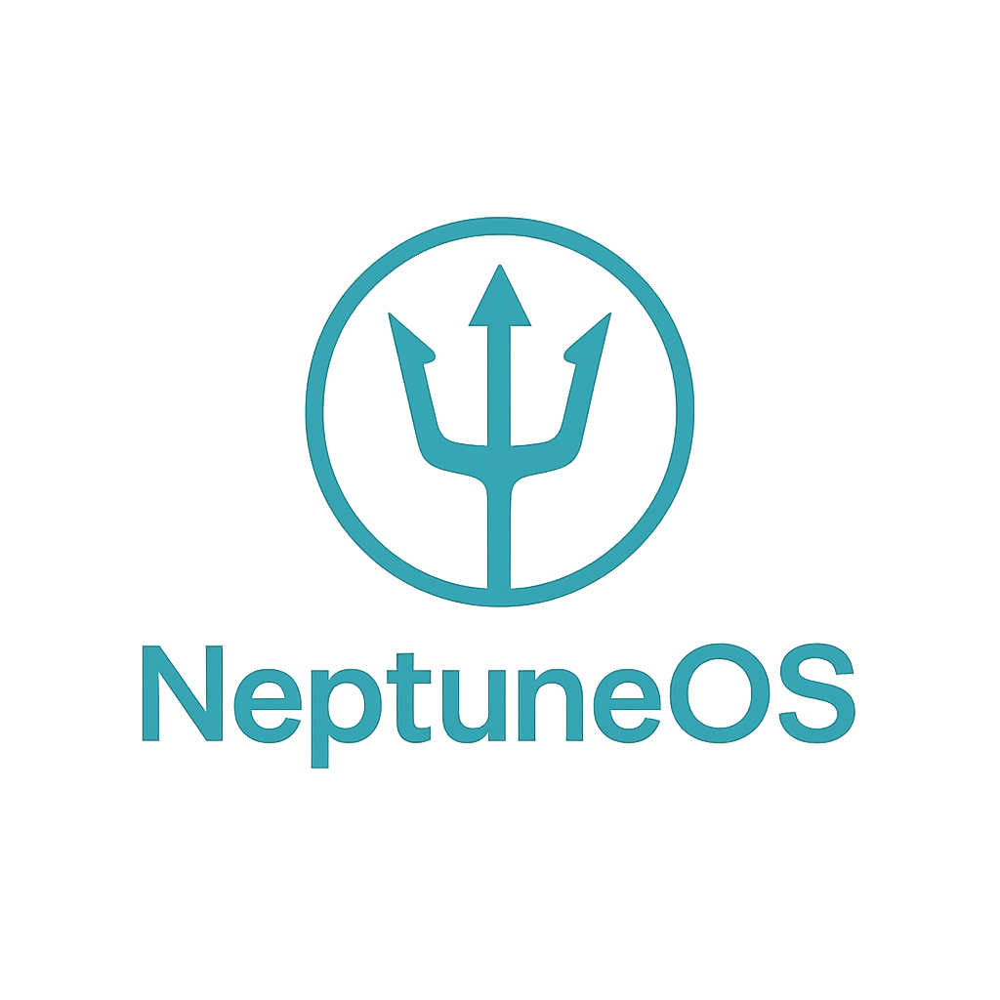

# 🌊 NeptuneOS - Aquarium Monitoring System

<div align="center">
  
  
  **A modern, responsive aquarium monitoring dashboard built with React & TypeScript**
  
  [](https://lovable.dev)
  [](https://reactjs.org/)
  [](https://www.typescriptlang.org/)
  [](https://tailwindcss.com/)
</div>

---

## 🐠 Overview

NeptuneOS is a sophisticated aquarium monitoring system that provides real-time temperature readings, live camera feeds, and comprehensive system management. Built with modern web technologies, it offers an intuitive interface for aquarium enthusiasts to monitor their aquatic environments.

## ✨ Features

### 🌡️ Temperature Monitoring
- **Dual Sensor Support** - Monitor temperature from two independent sensors
- **Real-time Updates** - Configurable auto-refresh intervals (5s, 10s, 30s, 60s)
- **Temperature Units** - Switch between Celsius and Fahrenheit
- **Smart Alerts** - Visual indicators for optimal, too cold, or too hot conditions
- **Average Calculation** - Automatic averaging of sensor readings

### 📹 Live Camera Feed
- **HD Video Stream** - High-definition live camera feed display
- **Responsive Layout** - Adapts to different screen sizes
- **Status Indicators** - Connection status and feed quality badges

### 🎨 Customizable Interface
- **Dark/Light Mode** - Toggle between themes for comfortable viewing
- **Responsive Design** - Works seamlessly on desktop, tablet, and mobile
- **Aquatic Theme** - Beautiful ocean-inspired color palette
- **Smooth Animations** - Engaging transitions and hover effects

### ⚙️ System Management
- **Network Configuration** - WiFi setup and monitoring
- **System Information** - CPU, memory, storage, and uptime tracking
- **Backup & Recovery** - Export/import system configurations
- **System Controls** - Reboot and factory reset functionality

### 🔒 Future Features (Coming Soon)
- **Lighting Control** - Automated lighting schedules
- **Filtration Management** - Filter monitoring and control
- **Feeding Automation** - Scheduled feeding system

## 🚀 Getting Started & Documentation

NeptuneOS is designed for easy deployment on a Raspberry Pi as a dedicated monitoring appliance. For detailed instructions on installation, hardware setup, development, and deployment, please refer to our comprehensive setup guide:

➡️ **[Full Setup & Deployment Guide (SETUP.md)](./SETUP.md)**

This single guide contains everything you need, from one-click automated installation to manual setup and troubleshooting.

## 🛠️ Tech Stack

| Technology | Purpose | Version |
|------------|---------|---------|
| ⚛️ **React** | Frontend Framework | 18.3.1 |
| 📘 **TypeScript** | Type Safety | Latest |
| 🎨 **Tailwind CSS** | Styling | Latest |
| 🧩 **shadcn/ui** | UI Components | Latest |
| ⚡ **Vite** | Build Tool | Latest |
| 🔄 **React Query** | State Management | 5.56.2 |
| 🧭 **React Router** | Navigation | 6.26.2 |
| 📊 **Recharts** | Data Visualization | 2.12.7 |
| 🎯 **Lucide React** | Icons | 0.462.0 |

## 📁 Project Structure

```
src/
├── 📱 components/
│   ├── 🎛️ settings/           # Settings page components
│   │   ├── SettingsHeader.tsx
│   │   ├── TemperatureSettingsCard.tsx
│   │   ├── AppearanceSettingsCard.tsx
│   │   ├── SystemInfoCard.tsx
│   │   ├── NetworkSettingsCard.tsx
│   │   ├── BackupRecoveryCard.tsx
│   │   └── SystemControlsCard.tsx
│   └── 🎨 ui/                 # Reusable UI components
├── 🌐 contexts/
│   └── SettingsContext.tsx    # Global settings state
├── 🪝 hooks/
│   └── use-toast.ts          # Toast notifications
├── 📄 pages/
│   ├── Index.tsx             # Main dashboard
│   ├── Settings.tsx          # Settings page
│   └── NotFound.tsx          # 404 page
├── 🛠️ utils/
│   └── temperature.ts        # Temperature utilities
└── 🎯 lib/
    └── utils.ts              # General utilities
```

## 🎯 API Integration

The app connects to a backend API for sensor data and a camera for a live video feed. These endpoints are configured to work seamlessly with the Raspberry Pi deployment. For more details, see the [deployment section in our setup guide](./SETUP.md).

### Temperature API
```typescript
// Expected API endpoint: /api/temperature
interface TemperatureData {
  sensor1: number;    // °C
  sensor2: number;    // °C
  average: number;    // °C
  timestamp: string;  // ISO string
}
```

### Camera Feed
- Expected video stream endpoint for live feed integration
- Placeholder displayed when camera is disconnected

## ⚙️ Configuration

### Environment Variables
Create a `.env` file for custom configuration:

```env
# API Configuration
VITE_API_BASE_URL=http://your-aquarium-device.local
VITE_CAMERA_STREAM_URL=http://your-camera-device.local/stream

# Feature Flags
VITE_ENABLE_CAMERA=true
VITE_ENABLE_FUTURE_FEATURES=false
```

### Default Settings
- **Temperature Unit**: Celsius
- **Refresh Interval**: 30 seconds
- **Auto Refresh**: Enabled
- **Theme**: Light mode
- **Temperature Thresholds**:
  - ❄️ Too Cold: < 24°C
  - ✅ Optimal: 24°C - 28°C
  - 🔥 Too Hot: > 28°C

## 🎨 Theming

NeptuneOS uses a comprehensive design system with aquatic-inspired colors:

### Color Palette
- 🌊 **Ocean Blue**: Primary brand color
- 🏝️ **Seafoam**: Secondary accent
- 🐚 **Light Aqua**: Subtle backgrounds
- 🪸 **Coral**: Warning and accent colors
- 🌊 **Wave Blue**: Light backgrounds

### Dark Mode
- Automatically adjusts all colors for comfortable night viewing
- Preserves color relationships and accessibility
- Smooth transitions between themes

## 📱 Responsive Design

NeptuneOS is fully responsive and optimized for:

- 🖥️ **Desktop** (1024px+): Full dashboard layout
- 📱 **Tablet** (768px+): Optimized grid layout
- 📱 **Mobile** (320px+): Stacked layout with touch-friendly controls

## 🚀 Deployment

All deployment instructions have been consolidated into our comprehensive [Setup Guide](./SETUP.md).

## 🤝 Contributing

We welcome contributions! Please follow these steps:

1. 🍴 Fork the repository
2. 🌿 Create a feature branch (`git checkout -b feature/amazing-feature`)
3. 💾 Commit changes (`git commit -m 'Add amazing feature'`)
4. 📤 Push to branch (`git push origin feature/amazing-feature`)
5. 📝 Open a Pull Request

## 📄 License

This project is licensed under the MIT License - see the [LICENSE](LICENSE) file for details.

## 🆘 Support

- 📚 [Lovable Documentation](https://docs.lovable.dev/)
- 💬 [Discord Community](https://discord.com/channels/1119885301872070706/1280461670979993613)
- 🎥 [Video Tutorials](https://www.youtube.com/watch?v=9KHLTZaJcR8&list=PLbVHz4urQBZkJiAWdG8HWoJTdgEysigIO)

## 🙏 Acknowledgments

- Built with ❤️ using [Lovable](https://lovable.dev)
- UI components by [shadcn/ui](https://ui.shadcn.com/)
- Icons by [Lucide](https://lucide.dev/)
- Design inspiration from modern aquarium monitoring systems

---

<div align="center">
  <strong>🌊 Dive into the future of aquarium monitoring with NeptuneOS! 🐠</strong>
</div>
